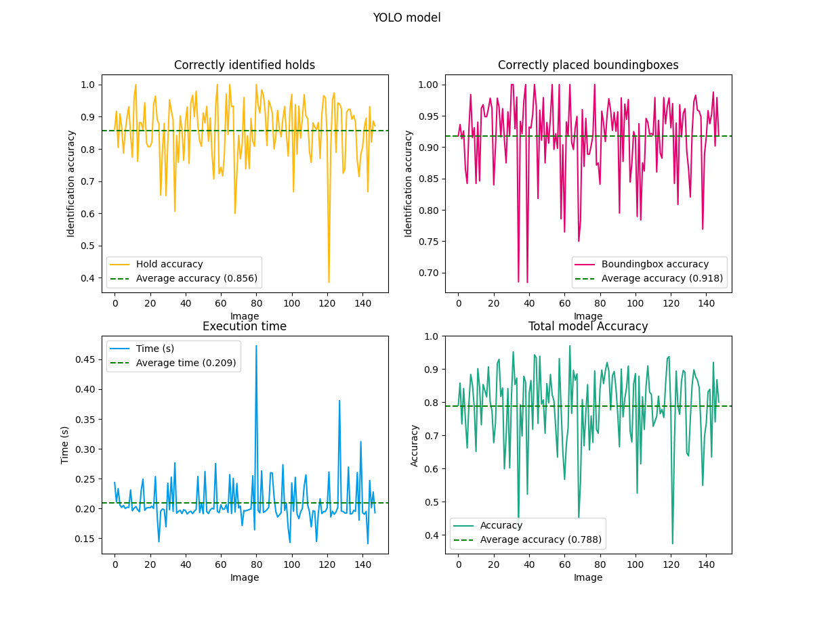
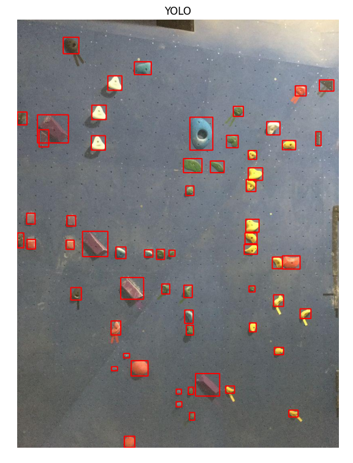
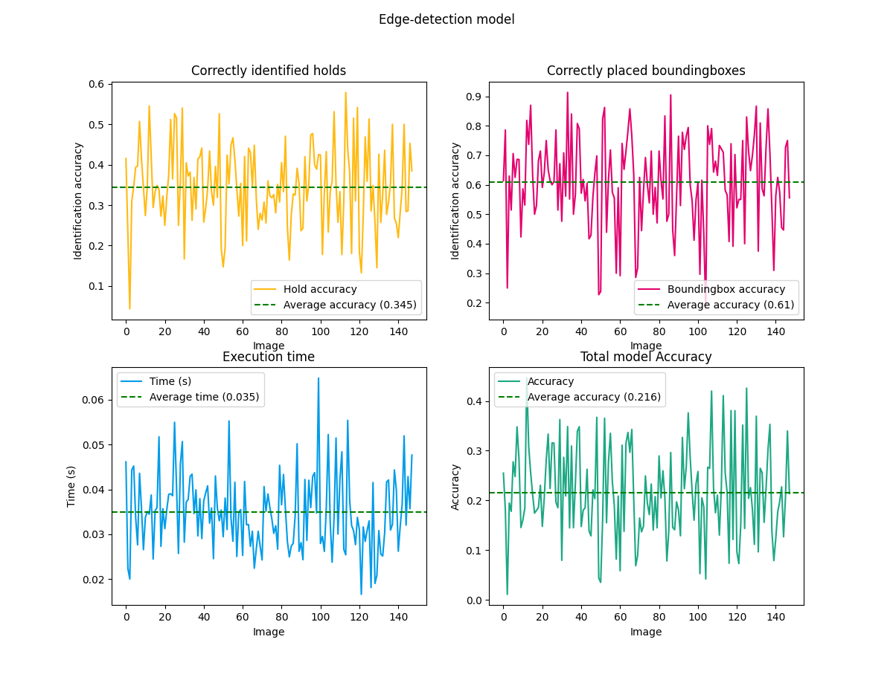
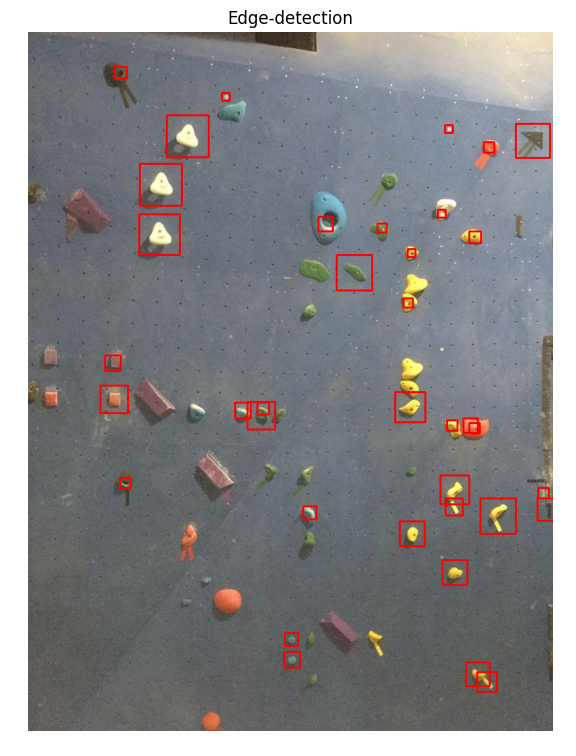

# Climbing-hold detection comparison

## Table of Contents
- [Introduction](#introduction)
- [Objectives](#objectives)
- [Technologies Used](#technologies-used)
- [Installation](#installation)
- [Results](#results)
- [Limitations](#limitations)
- [Acknowledgements](#acknowledgements)

## Introduction
This project focuses on the implementation and comparison of two distinct approaches for detecting climbing holds: an edge detection algorithm and a YOLO (You Only Look Once) model. The edge detection algorithm aims to identify the edges of climbing holds based on their contours, providing a traditional computer vision solution. In parallel, we trained a YOLO model, leveraging deep learning techniques to detect climbing holds in images.

The primary objective of this project is to evaluate the performance of both methods in terms of execution-speed and accuracy. By analyzing these metrics, we aim to determine the most efficient and effective approach for climbing hold detection, which often is an important first step in climbing related applications.

## Objectives
- Detect climbing holds using simple Edge-detection algorithm
- Detect climbing holds using a trained YOLO-model
- Compare execution-speed and accuracy of both approaches

## Technologies Used
- Programming Language: Python
- Tools: OpenCv, Roboflow, Ultralytics

## Installation

```bash
# Clone the repository
git clone https://github.com/AdamPolanik/KandidatArbete.git

# Navigate to the project directory
cd KandidatArbete

# Install missing dependencies

# Update filepath for folder containing images and labels in class: testProgramYOLO.py and testProgramEdgeDetection.py
pictureFolderPath = "Path_to_images_and_textfiles_containing_information_about_holdplacement"

# Run YOLO-detection 
python3 testProgramYOLO.py

# Run Edge-detection
python3 testProgramEdgeDetection.py

```
## Results

<div align="center">
    
    <p><em>Figure 1: Example of climbing hold detection metrics using YOLO model.</em></p>
</div>

<div align="center">
    
    <p><em>Figure 2: Example of climbing hold detection results using YOLO model.</em></p>
</div>

<div align="center">
    
    <p><em>Figure 3: Example of climbing hold detection metrics using edge detection algorithm.</em></p>
</div>

<div align="center">
    
    <p><em>Figure 4: Example of climbing hold detection results using edge detection algorithm.</em></p>
</div>


## Limitations
A big limiting factor for this study is the very simple implementation of the edge-detection based detection model. A more advanced implementation or the use of a different edge detection algorithm might have yielded better results. Additionally, incorporating color information, given the bright and saturated colors of climbing holds, could potentially enhance the performance of the edge detection approach. Parameters in the blobDetector could also be fine tuned to increase accuracy.

Another limitation pertained to the training dataset used for the YOLO model. The dataset was selected primarily for its availability and the constraints of time and cost. While it was adequate for the scope of this study, a more extensive dataset with greater variability in lighting conditions and climbing hold types could improve the YOLO model's performance. We observed that the model struggled with images of lower quality or dim lighting, and it also had difficulty accurately detecting holds in images with people, particularly when they wore brightly colored clothing. Future improvements could focus on expanding the dataset to include such challenging scenarios and further developing the models to handle these edge cases more effectively.

## Acknowledgements
Supervisor: Mateus De Oliveira Oliveira

University: Stockholm University - Department of Computer and Systems Sciences
